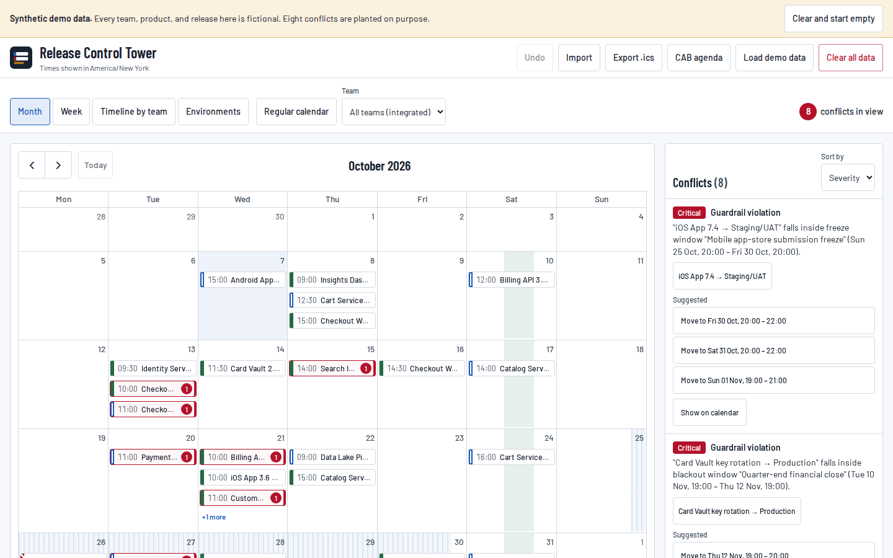
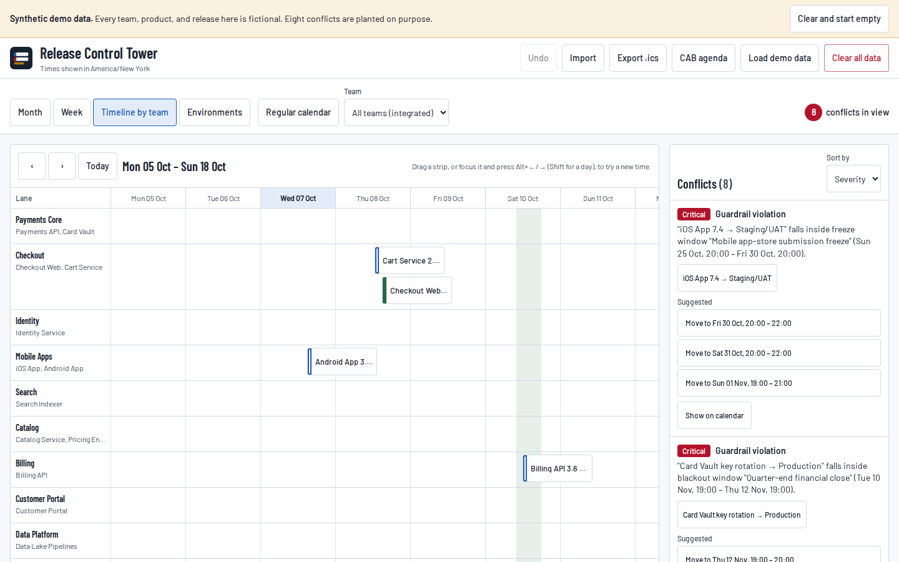
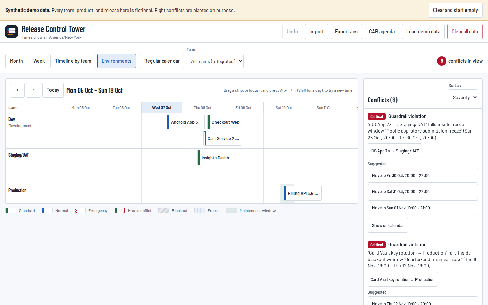
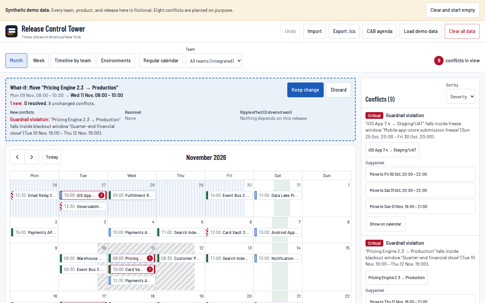
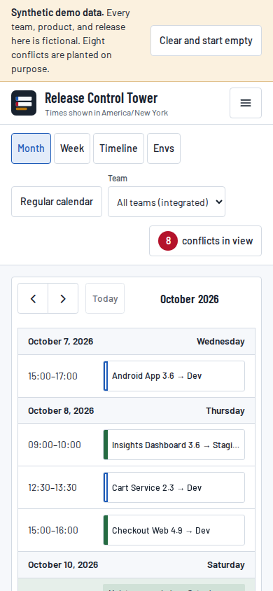
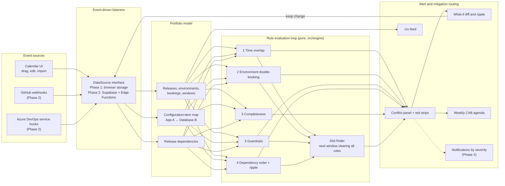

# Release Control Tower

An **integrated release calendar** that puts every team's releases on one timeline and flags problems before they happen: overlapping work on the same system, double-booked environments, changes inside blackout or freeze windows, releases scheduled before the work they depend on, and change requests with no rollback or test plan. It does not block anything. It flags the problem and suggests the next window that clears every rule.

Filter it to one team and it becomes a **regular release calendar**. Both are the same data and the same evaluation, so they never disagree.

**Live:** https://kingdomb.github.io/release-control-tower/

Built to demonstrate release-management practice: ITIL change classes, a minimum viable CAB, guardrail windows, and a project that ships under the same release discipline it models (gated CI, semantic versions, a changelog, a go/no-go checklist, and a rollback runbook).

> The demo loads **synthetic data** for a fictional online retailer. No team, product, or release refers to a real organisation or person. A banner says so whenever it is loaded, with one click to clear it and start empty.



## What it does

| Feature | Where |
| --- | --- |
| Month, week, and swimlane timeline by team; conflicts in red with a count and tooltip | Month · Week · Timeline by team |
| Regular calendar: one click filters to a team (and optionally one product) | Regular calendar toggle, Team filter |
| Per-environment booking lanes, including non-release bookings such as QA cycles | Environments |
| Blackout, freeze, and maintenance windows drawn as shaded bands | All views |
| Sortable conflict panel with rule, releases, severity, and 1–3 suggestions; click to focus | Right column (slide-over on small screens) |
| What-if: drag a release (or Alt+←/→ on the timeline) to see the conflict diff and ripple effect before you keep it; one-click undo | What-if bar |
| ITIL change class badge (Standard, Normal, Emergency) with its meaning on hover or focus | Release details |
| Release drawer: edit the five RFC fields with completeness warnings | Click any release |
| `.ics` export for all teams or one team | Export .ics |
| Printable weekly CAB agenda for a Minimum Viable CAB | CAB agenda |
| CSV and JSON import with column mapping, per-row errors, and templates | Import |

| | |
| --- | --- |
|  |  |
|  |  |

## The five rules

All rules are pure functions in [`src/engine/`](src/engine), each with unit tests. Times are half-open ranges, so a release that ends at 14:00 does not clash with one that starts at 14:00. All-day items are resolved in the viewer's time zone, including on DST change days.

| # | Rule | Fires when | Severity |
| --- | --- | --- | --- |
| 1 | Time overlap | Two releases touch the same product or the same configuration item at overlapping times | High if production is involved, else medium |
| 2 | Environment double-booking | Two occupants of one environment overlap (releases, or a release and a booking such as a QA cycle) | Production high, staging medium, dev low |
| 3 | Guardrail violation | A release overlaps a blackout or freeze in its scope; or a **Normal** change to production is not fully inside an approved maintenance window (back-to-back windows count as one) | Critical; Emergency changes medium (allowed with ECAB sign-off) |
| 4 | Dependency order | A release starts before a release it depends on has finished | High |
| 5 | Completeness | A Normal or Emergency change has no rollback plan or no test plan | Normal high, Emergency medium |

**Suggestions.** For rules 1–4 the engine searches forward in 30-minute steps (whole days for all-day items) for up to three slots, a day apart, that clear *every* time-based rule for that release, not just the one that fired. It never moves an upstream release past the releases that depend on it. Completeness conflicts get actions ("Add a rollback plan") because no time slot fixes them.

**Ripple effect.** Moving a release lists everything downstream: releases that depend on it (transitively), and releases that touch configuration items depending on the ones it touches (App A depends on Database B), scheduled at or after it. Releases the move now blocks are marked.

## Architecture



Every change, whether from the UI today or a webhook in Phase 2, goes through the `DataSource`. The full dataset is re-evaluated, and conflicts are routed to the panel, the what-if preview, the CAB agenda, and (in Phase 2) notifications. Conflict IDs are stable, so the what-if diff can say exactly which problems a change adds and which it resolves.

```
src/
  domain/        types, time handling (half-open ranges, IANA time zones, DST)
  engine/        five rules, ripple effect, slot finder, evaluate + diff  (pure, unit-tested)
  data/          DataSource interface, LocalDataSource, seed generator, CSV/JSON import
  export/        .ics feed, CAB agenda model
  state/         store: committed data, what-if draft, undo history
  views/         calendar (FullCalendar MIT plugins), swimlane timeline, lanes
  components/    header, conflict panel, what-if bar, release drawer, dialogs
e2e/             Playwright: acceptance flows, layout QA at 14 widths, axe checks
docs/            Phase 2 design, release checklist, rollback runbook, go/no-go
```

FullCalendar's resource-timeline is a premium plugin whose free licences are GPL or non-commercial only, so the swimlane timeline is built in-house.

## Run it

Requires Node 20.19 or later.

```bash
npm ci
npm run dev          # http://localhost:5173/release-control-tower/
```

| Command | What it does |
| --- | --- |
| `npm test` | Unit tests: every rule and edge case, seed, import, `.ics`, CAB agenda |
| `npm run lint` / `npm run typecheck` | ESLint, TypeScript |
| `npm run build` | Production build into `dist/` |
| `npm run e2e` | Playwright against the built site: acceptance flows, layout QA, axe |
| `npm run qa` | Layout QA only: 14 viewport widths, prints a summary table, writes screenshots to `qa-output/` |

## Import your own schedule

1. Open **Import**, then **Download CSV template** (or the JSON template, which also shows how to define blackout, freeze, and maintenance windows).
2. Fill one row per release. Required columns: `title`, `team`, `product`, `environment`, `start`, `end`.
3. Choose your file. Columns are matched by name; fix any that are wrong in the mapping step.
4. Review: valid rows are counted, and each bad row is listed with its row number and the exact problem. Choose **Add to current data** (rows with a matching `id` are updated) or **Replace current data**, then import. Undo is one click.

| Column | Accepts |
| --- | --- |
| `environment` | `dev`, `development`, `test`; `staging`, `uat`, `qa`, `preprod`; `prod`, `production`, `live` |
| `start`, `end` | `2026-03-10T14:00Z` or any ISO offset; `2026-03-10 09:00` (read in your time zone); `2026-03-10` for all-day (end is the last day, inclusive) |
| `change_class` | `standard`, `normal` (default), `emergency` |
| `status` | `planned` (default), `approved`, `in-progress`, `completed`, `cancelled` |
| `depends_on` | IDs or titles of releases that must finish first, separated by `;` |
| `config_items` | Systems the release touches, separated by `;` |
| `description`, `impact_risk`, `implementation_plan`, `rollback_plan`, `test_plan` | The five RFC fields |

Teams, products, environments, and configuration items named in the file are created if they do not exist. A JSON file can be an array of row objects (same columns) or a full dataset, as in the JSON template.

Your schedule stays in your browser (`localStorage`); it is never uploaded. The page itself loads its fonts from Google Fonts.

## Phase 2

Phase 1 is fully client-side. Phase 2 swaps `LocalDataSource` for a Supabase implementation of the same interface: Postgres for the model, Edge Functions as webhook receivers for GitHub and Azure DevOps, server-side evaluation with the same engine, and severity-based notifications. See [docs/PHASE-2.md](docs/PHASE-2.md) for the schema and the webhook flow.

## How this project is released

- Every push to `main` and every pull request runs lint, type-check, unit tests, build, end-to-end tests, layout QA at 14 widths, and axe accessibility checks ([ci.yml](.github/workflows/ci.yml)).
- Deploys happen only from a `vX.Y.Z` tag, only after the same gates pass on that commit, and only if the tag matches `package.json` ([deploy.yml](.github/workflows/deploy.yml)). The deploy job then checks that the live page, its script bundle, and its stylesheet all load, and that the bundle contains the rule engine.
- [CHANGELOG.md](CHANGELOG.md), [Release checklist](docs/RELEASE-CHECKLIST.md), [Go/no-go](docs/GO-NO-GO.md), [Rollback runbook](docs/ROLLBACK-RUNBOOK.md).

## Accessibility

Keyboard: every control and every release strip is reachable; Enter opens details; Alt+←/→ (Shift for a day) moves a strip on the timeline as a what-if; Escape closes any overlay and returns focus. Focus is always visible (3px outline). Change class is shown by pattern as well as colour. Tap targets are at least 44×44px everywhere except inside the month grid, where release strips are 44px tall on touch screens and the "+N more" link meets the WCAG 2.2 AA minimum of 24×24px. CI runs axe (WCAG 2.2 AA rules) on every view and dialog at desktop and phone widths, and checks that Tab reaches the timeline strips.

In the month grid, a blackout, freeze, or maintenance window that covers only part of a day shades only that part of the cell (left edge 00:00, right edge 24:00); hover a band for its exact times.
